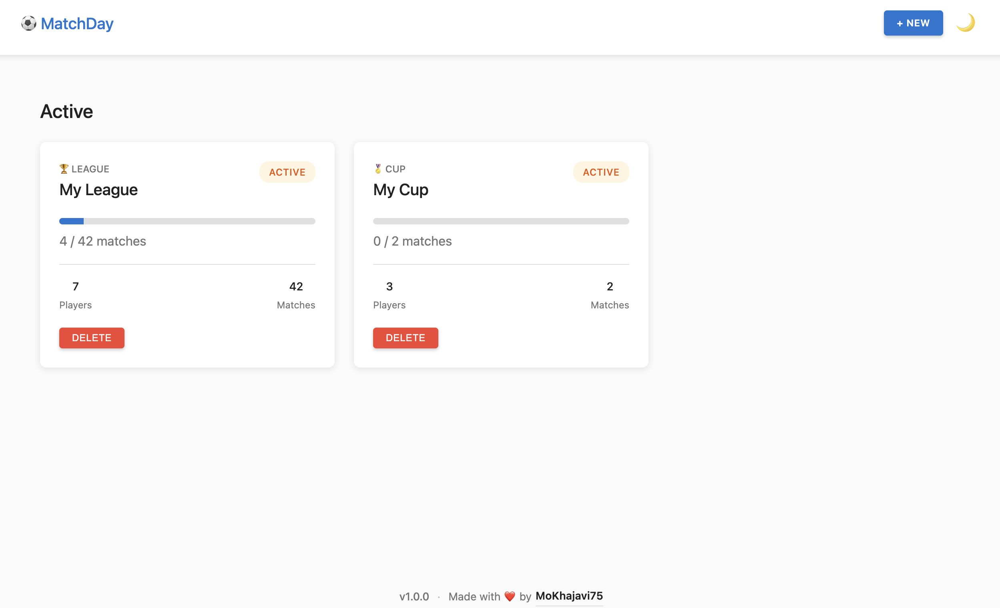
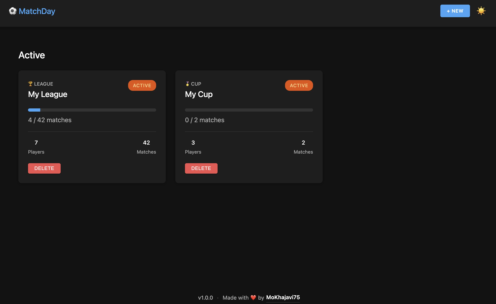

# ⚽ MatchDay - FIFA Match Manager

A modern, local web application for managing FIFA matches between friends with two competition formats: Home & Away League and Knockout Cup. Built with vanilla JavaScript, HTML5, and CSS3.

<p align="center">
  
  &nbsp;
  
</p>

## Features

### Competition Formats

- **League (Round-Robin)**: Each player plays every other player twice (home & away)
  - Balanced scheduling using circle method
  - Points-based standings (Win: 3pts, Draw: 1pt, Loss: 0pt)
  - Comprehensive statistics tracking
  - Automatic winner determination

- **Cup (Knockout)**: Single elimination tournament bracket
  - Works with any number of players (automatic bye allocation for non-power-of-2)
  - Visual bracket display with winner progression
  - Color-coded results (winners in green, losers grayed out)

### Key Features

- Clean, modern Material-inspired UI
- Dark mode
- Fully offline-capable (localStorage persistence)
- Responsive design (mobile, tablet, desktop)
- Support for unlimited players (minimum 2)
- Real-time standings updates
- Match result entry and editing
- Competition reset functionality
- Progress tracking

## Technology Stack

- **Frontend**: Vanilla JavaScript (ES6 modules), HTML5, CSS3
- **Storage**: localStorage (offline-first, no server required)
- **Package Manager**: pnpm
- **Dev Tools**: live-server, prettier

## Getting Started

### Prerequisites

- Node.js (v24 or higher)
- pnpm (or npm/yarn)

### Installation

1. Clone the repository:

```bash
git clone git@github.com:MoKhajavi75/matchday.git
cd matchday
```

2. Install dependencies:

```bash
pnpm install
```

3. Start the server:

```bash
pnpm start
```

It will open your browser and navigate to the app.

## Usage

### Creating a Competition

1. Click "+ New" in the header
2. Select competition type (League or Cup)
3. Enter a competition name
4. Add player names (minimum 2, no maximum limit)
5. Review and confirm

The app will automatically generate all fixtures based on the competition type.

### Recording Match Results

- **League**: Click "Add Result" on any scheduled match
- **Cup**: Click "Add Result" on active bracket matches
- Enter scores for both players (0-99)
- Results automatically update standings/bracket

### Viewing Results

- **League**: View standings table with full statistics (P, W, D, L, GF, GA, GD, Pts)
- **Cup**: Visual bracket showing progression through rounds
- Winner is automatically determined and displayed when competition completes

### Managing Competitions

- **Reset**: Clear all match results while keeping competition structure
- **Delete**: Permanently remove a competition and all associated data
- All data persists in localStorage across browser sessions

## Algorithms

### Round-Robin Scheduling (League)

Uses the **circle method** for balanced fixture generation:

- Fixes first player in position
- Rotates remaining players clockwise for each round
- Ensures each player appears at most once per round
- Works with any number of players
- Generates return fixtures for home & away format

**Example with 4 players:**

- Round 1: P1-P2, P3-P4
- Round 2: P1-P3, P2-P4
- Round 3: P1-P4, P2-P3
- Rounds 4-6: Return fixtures with swapped home/away

### Knockout Bracket (Cup)

Supports any number of players with automatic bye allocation:

1. Calculates bracket slots needed (next power of 2)
2. Calculates number of byes required (slots - players)
3. Randomly distributes byes to first round positions
4. Players with byes automatically advance to next round
5. Creates linked match structure for winner progression

**Example with 6 players:**

- Needs 8 slots → 2 byes required
- Randomly assign 2 players to receive byes
- Other 4 players compete in first round
- Bye players advance to semi-finals automatically

### Standings Sort

League standings sorted by:

1. Points (descending)
2. Goal Difference (descending)
3. Goals For (descending)
4. Player Name (ascending)

## Data Storage

All data is stored in localStorage with the following structure:

```javascript
{
  "matchday:competitions": [...],  // Competition records
  "matchday:players": [...],       // Player records with stats
  "matchday:matches": [...],       // Match records
  "matchday:version": "1.0.0"      // Schema version
}
```

### Storage Limits

- localStorage typically supports 5-10MB
- Sufficient for hundreds of competitions
- App will alert if quota is exceeded

## Browser Compatibility

- Chrome/Edge: ✅ Full support
- Firefox: ✅ Full support
- Safari: ✅ Full support
- Mobile browsers: ✅ Responsive design

Requires:

- ES6 module support
- localStorage API
- CSS Grid and Flexbox

## Contributing

This is a personal project, but suggestions and improvements are welcome!

## Acknowledgments

- Material Design for UI inspiration
- Round-robin algorithm based on circle method
- Knockout bracket generation using power-of-2 slot allocation
